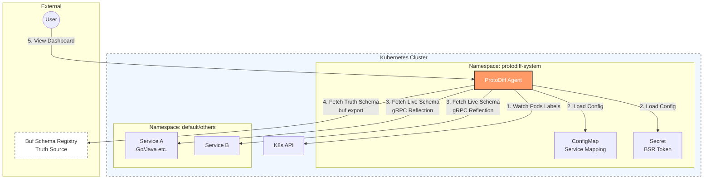

# ProtoDiff

[](https://github.com/uzdada/protodiff/actions/workflows/ci.yaml)
[](https://hub.docker.com/r/uzdada/protodiff)
[](https://hub.docker.com/r/wooojin2da/protodiff)
[](https://www.google.com/search?q=LICENSE)

**Kubernetes-native gRPC Schema Drift Detection Tool**

### Overview

ProtoDiff is a Kubernetes-native monitoring tool designed to detect schema drift between live gRPC services and the Buf Schema Registry (BSR). It runs as a lightweight agent within your cluster, continuously validating schema consistency across microservices without requiring sidecars, code changes, or restarts.

### Key Features

- **Non-Invasive**: Zero changes required to existing microservices.
- **Visual Dashboard**: Built-in HTML dashboard for real-time status.
- **Centralized Configuration**: Manage Service-to-BSR mappings via ConfigMap.
- **Automatic Discovery**: Discovers gRPC pods dynamically using Kubernetes labels.
- **gRPC Reflection**: Utilizes server reflection to fetch live schemas.
- **Real-time Monitoring**: Continuous validation with configurable scan intervals.
- **Clear Status UI**: Traffic light indicators (Green=Sync, Red=Mismatch, Yellow=Unknown).

### Prerequisites

- Kubernetes cluster (v1.25+)
- `kubectl` configured to access your cluster
- gRPC services with **Server Reflection** enabled
- **BSR Token** (Required for BSR schema validation)
    - Obtain a token from [Buf Settings](https://buf.build/settings/user).
    - *Note: Public BSR modules can be accessed without a token.*

### Quick Demo

Want to try ProtoDiff immediately without integrating it into your existing services?
Check out the **[Quickstart Demo](./examples/SAMPLE_QUICKSTART.md)** to run a complete sandbox environment.

-----

### Installation


**1. Download the Manifest**

```bash
curl -O https://raw.githubusercontent.com/uzdada/protodiff/main/deploy/k8s/install.yaml
```

**2. Configure Service Mappings**

Edit the `ConfigMap` in `install.yaml` to map your Kubernetes services to BSR modules.
**Crucial**: The key must match the value of the **`app` label** on your target Pods.

```yaml
# Inside install.yaml
apiVersion: v1
kind: ConfigMap
metadata:
  name: protodiff-mapping
data:
  # Format: "your-pod-app-label-value": "your-bsr-module-url"
  user-service: "buf.build/acme/user"
  payment-service: "buf.build/acme/payment"
```

**3. Set BSR Token**

For security, create the secret directly using `kubectl` instead of editing the YAML file.

```bash
kubectl create secret generic bsr-token \
  --from-literal=token=YOUR_BSR_TOKEN_HERE \
  -n protodiff-system
```

**4. Deploy**

```bash
kubectl apply -f install.yaml
```

#### Access the Dashboard

Once deployed, forward the port to access the web interface:

```bash
kubectl port-forward -n protodiff-system svc/protodiff 18080:80
```

Open your browser to [http://localhost:18080](http://localhost:18080).

-----

### Architecture

ProtoDiff follows the Hexagonal Architecture pattern for separation of concerns and testability.



```
protodiff/
├── cmd/protodiff/              # Application entrypoint
├── internal/
│   ├── core/
│   │   ├── domain/             # Business models
│   │   └── store/              # Thread-safe in-memory storage
│   ├── adapters/
│   │   ├── k8s/                # Kubernetes client (Auto-discovery)
│   │   ├── grpc/               # gRPC reflection client
│   │   ├── bsr/                # BSR clients (Buf CLI wrapper)
│   │   └── web/                # HTTP server & Dashboard
│   └── scanner/                # Schema validation orchestrator
└── deploy/k8s/                 # Kubernetes manifests
```

### How It Works

1.  **Discovery**: Scans the cluster for Pods with `app` labels matching the ConfigMap keys.
2.  **Resolution**: Maps the discovered Pod to its corresponding BSR module.
3.  **Validation**:
    * Fetches the **Live Schema** from the Pod via gRPC Reflection.
    * Fetches the **Truth Schema** from the Buf Schema Registry.
    * Compares schemas to detect drift.
4.  **Visualization**: Updates the in-memory store and reflects the status on the dashboard.

### Configuration

#### Environment Variables

| Variable | Description | Default |
| :--- | :--- | :--- |
| `CONFIGMAP_NAMESPACE` | Namespace of the mapping ConfigMap | `protodiff-system` |
| `CONFIGMAP_NAME` | Name of the mapping ConfigMap | `protodiff-mapping` |
| `DEFAULT_BSR_TEMPLATE` | Fallback BSR module template | `""` |
| `WEB_ADDR` | Web server listen address | `:18080` |
| `SCAN_INTERVAL` | Time between validation scans | `30m` |

#### BSR Template (Wildcard Support)

If a service is not explicitly defined in the ConfigMap, you can use a template pattern.

Example:

```bash
DEFAULT_BSR_TEMPLATE="buf.build/acme/{service}"
```

If ProtoDiff finds a pod with `app=billing-service`, it will automatically check against `buf.build/acme/billing-service`.

### Technical Details

#### Port Auto-Detection

ProtoDiff attempts to automatically identify the gRPC port of a target Pod:

1.  Scans `containerPort` definitions.
2.  Looks for ports named `"grpc"` or using the `TCP` protocol.
3.  Falls back to port `9090` if no specific configuration is found.

#### Multi-Architecture Support

Docker images are built for both **AMD64** and **ARM64**.

- `linux/amd64` (Standard Servers)
- `linux/arm64` (Apple Silicon, AWS Graviton)

### Troubleshooting

**Dashboard shows "No gRPC services discovered yet"**

* Verify `protodiff-mapping` ConfigMap exists in the `protodiff-system` namespace.
* Ensure your target Pods are in the `Running` state.
* Check that your Pods have an `app` label that exactly matches a key in the ConfigMap.

**Status shows "UNKNOWN"**

* Ensure **Server Reflection** is enabled on your gRPC service.
* Check network policies to ensure ProtoDiff can reach the target Pod IP.
* Verify the gRPC port; if not 9090, ensure it is named `grpc` in your Pod spec.

**"No BSR module mapping found"**

* Add the service to the ConfigMap or configure the `DEFAULT_BSR_TEMPLATE` environment variable.
* After updating the ConfigMap, restart the ProtoDiff pod:
  ```bash
  kubectl rollout restart deployment/protodiff -n protodiff-system
  ```

### Development

#### Build from Source

```bash
git clone https://github.com/uzdada/protodiff.git
cd protodiff

make deps          # Install dependencies
make build         # Build binary
make docker-build  # Build Docker image
```

### Contributing

Contributions are welcome\! Please see [CONTRIBUTING.md](CONTRIBUTING.md) for details.

### License

This project is licensed under the Apache License 2.0. See [LICENSE](LICENSE) for details.

### Contact

- GitHub Issues: [https://github.com/uzdada/protodiff/issues](https://github.com/uzdada/protodiff/issues)