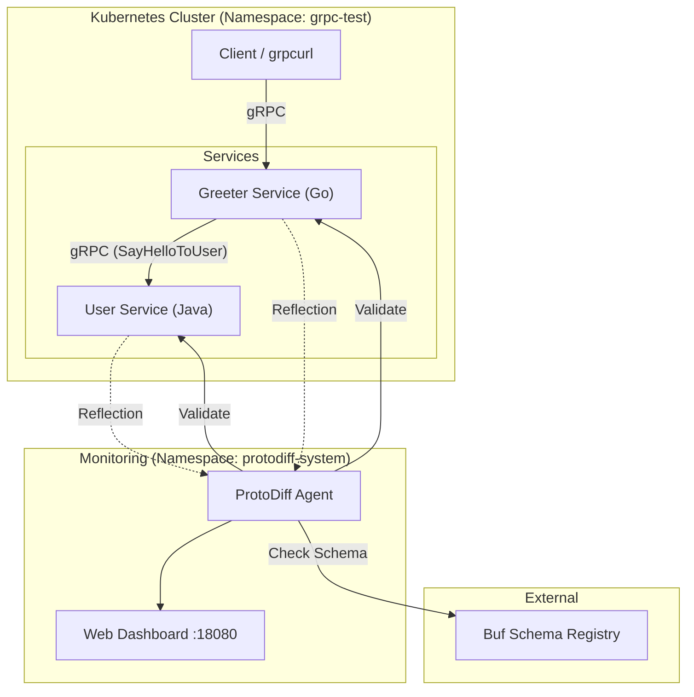

# ProtoDiff Quickstart Demo

This guide provides a sandbox environment to demonstrate ProtoDiff's
capabilities in a realistic microservices scenario.<br><br> By running a single
script, you will deploy a complete Kubernetes environment, including two
test gRPC servers (one Go, one Java) running as pods, along with
interacting services and active schema monitoring.

## 1\. Scenario Overview

This demo simulates a typical microservices architecture where schema consistency is critical.

* **Greeter Service (Go)**: A frontend service that handles user greetings.
* **User Service (Java)**: A backend service that manages user data.
* **Interaction**: The Go service makes gRPC calls to the Java service (`SayHelloToUser` -\> `GetUser`).
* **Monitoring**: ProtoDiff monitors both services to ensure their runtime schemas match the definitions in the Buf Schema Registry (BSR).

### Architecture

The following diagram illustrates the deployment topology and traffic flow.



## 2\. Prerequisites

* **Kubernetes Cluster**: Minikube, Kind, Docker Desktop, or any standard K8s cluster.
* **kubectl**: Configured and connected to the cluster.
* **Git**: To clone the repository.

## 3\. Deployment

Run the automated demo script. This script handles namespace creation, deployment of the test services (Go/Java), and the ProtoDiff agent configuration.

```bash
git clone https://github.com/uzdada/protodiff.git
cd protodiff/examples

# Run the deployment script
./demo.sh
```

**What the script performs:**

1.  Creates `grpc-test` and `protodiff-system` namespaces.
2.  Deploys the sample Go and Java microservices.
3.  Deploys the ProtoDiff agent configured to monitor these specific services.
4.  Initiates port-forwarding for the dashboard and gRPC ports.

Once the script completes, the dashboard will open automatically in your default browser.

**Dashboard URL**: [http://localhost:18080](https://www.google.com/search?q=http://localhost:18080)

## 4\. Verification & Testing (Optional)

The demo script sets up local port forwarding for easy interaction. You can use `grpcurl` to interact with the services and observe the results.

### A. Test Inter-service Communication

Trigger the Go service to call the Java service. This confirms the microservices are functioning correctly.

```bash
# Call Go Service -> Java Service
grpcurl -plaintext -d '{"user_id": 1}' localhost:9090 greeter.Greeter/SayHelloToUser

# Expected Output:
# {
#   "message": "Hello admin (ID: 1, Email: admin@example.com)! Greetings from Go Greeter Service!"
# }
```

### B. Direct Service Access

You can also query the Java service directly to verify independent functionality.

```bash
# Call Java Service directly
grpcurl -plaintext -d '{"user_id": 1}' localhost:9091 user.UserService/GetUser
```

## 5\. Monitoring Dashboard

Navigate to [http://localhost:18080](https://www.google.com/search?q=http://localhost:18080) to view the real-time schema validation status.

### Status Interpretation

| Status | Description | Action Required |
| :--- | :--- | :--- |
| **IN\_SYNC** | The runtime schema matches the BSR module. | None. The environment is consistent. |
| **MISMATCH** | The runtime schema differs from the BSR module. | Investigate drift. Check if the deployment is outdated or if the BSR is behind. |
| **UNKNOWN** | Unable to fetch schema or connect to the service. | Check Pod status, network policies, or reflection settings. |

### How Validation Works

ProtoDiff performs the following operations on a configured interval (default: 30s):

1.  **Fetch Live Schema**: Connects to the Pods via gRPC Server Reflection.
2.  **Fetch Truth Schema**: Downloads the latest module definition from the Buf Schema Registry (`buf.build/proto-diff-bsr/test-services`).
3.  **Diff**: Compares the descriptors. Any discrepancy results in a `MISMATCH` status.

*Note: The test services in this demo are mapped to a public BSR repository, so no authentication token is required.*

## 6\. Cleanup

To stop the port forwarding, press `Ctrl+C` in the terminal running the `demo.sh` script.

To completely remove all resources created by this demo from your cluster:

```bash
kubectl delete namespace grpc-test
kubectl delete namespace protodiff-system
```

## 7\. Next Steps

To deploy ProtoDiff in your production environment:

1.  Refer to the [Main Installation Guide](https://www.google.com/search?q=../README.md).
2.  Update the `ConfigMap` to point to your organization's BSR modules.
3.  Ensure your services have gRPC Reflection enabled.